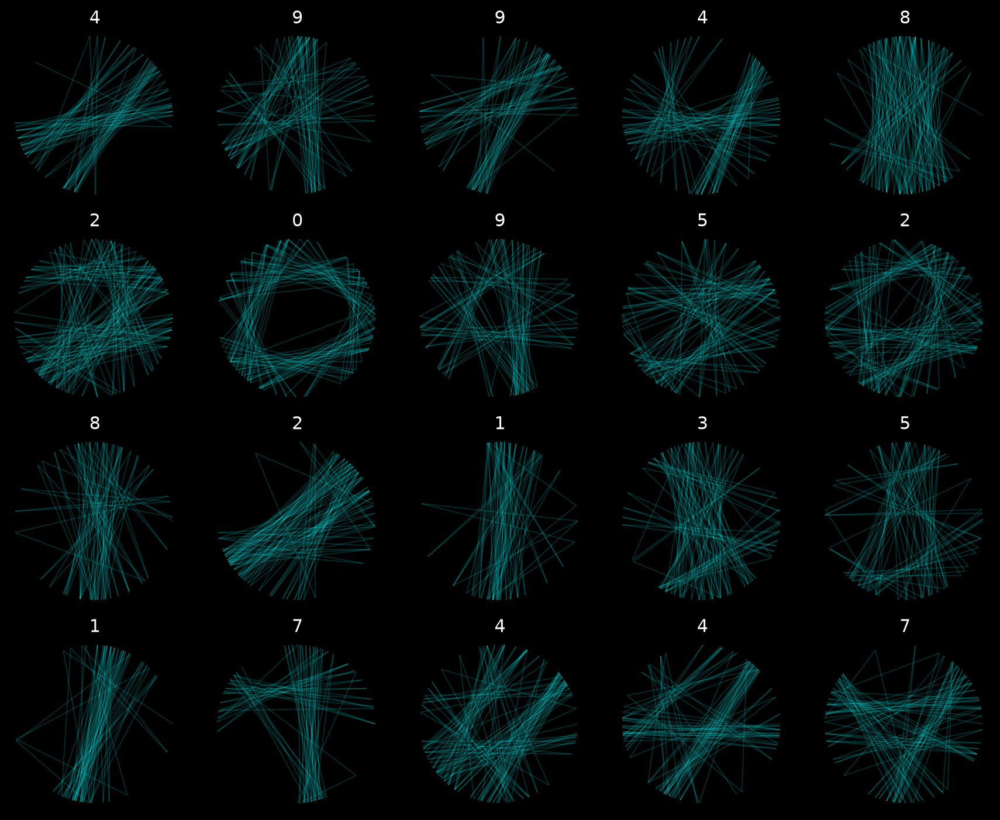

# Nitograph

**Nitograph превращает цифры MNIST в неоновый string-art, а затем обучает небольшой class-conditioned Transformer генерировать новые непрерывные последовательности гвоздей.**

[English](README.md) | [中文](README.zh.md)




## Почему Это Интересно

Nitograph - не обычная text-to-image игрушка. Это компактный генеративный pipeline для конкретного физического представления: одна нить движется вокруг круглого набора гвоздей.

- Превращает MNIST-цифры в упорядоченные переходы между гвоздями.
- Обучает autoregressive Transformer на токенизированных string-art последовательностях.
- Генерирует новые пути, conditioned только на классе цифры.
- Рендерит четкий 4096x4096 neon output через batched Matplotlib line layers.
- Сохраняет точную последовательность гвоздей в JSON, чтобы результат был воспроизводимым.

Коротко: **image -> string-art encoder -> sequence dataset -> causal Transformer -> generated thread path -> 4K render**.

## Демо-Ассеты

Превью лежат в [`images/`](images):

- [`images/dataset_preview_img.png`](images/dataset_preview_img.png) - примеры encoded dataset.
- [`images/digit_7_4k.png`](images/digit_7_4k.png) - пример сгенерированного 4K output.

Веса модели и реальный пример вывода можно взять из [`model_and_output_examples/`](model_and_output_examples):

- [`model_and_output_examples/string_ai.pt`](model_and_output_examples/string_ai.pt) - обученный checkpoint.
- [`model_and_output_examples/digit_7_4k.png`](model_and_output_examples/digit_7_4k.png) - готовый render.
- [`model_and_output_examples/digit_7_4k.json`](model_and_output_examples/digit_7_4k.json) - точная nail sequence.

## Установка

Рекомендуется Python 3.11 или 3.12.

```bash
python -m venv .venv

# Windows
.venv\Scripts\activate

# Linux/macOS
source .venv/bin/activate

python -m pip install --upgrade pip
pip install -r requirements.txt
```

Для NVIDIA GPU лучше поставить сборку PyTorch под вашу версию CUDA через официальный PyTorch installer, а затем установить остальные зависимости.

## Быстрый Старт

### 1. Создать Датасет

Быстрый smoke run:

```bash
python prepare_dataset.py --samples 100 --max-lines 120 --output smoke_dataset.npz
python preview_dataset.py --dataset smoke_dataset.npz --output dataset_preview.png
```

Более качественный training run:

```bash
python prepare_dataset.py --samples 5000 --max-lines 240
python preview_dataset.py --dataset string_dataset.npz --output dataset_preview.png
```

По умолчанию builder создает canonical prototypes для каждой цифры. Это хорошо подходит текущей модели, потому что генерация conditioned по классу, а не по исходному изображению.

### 2. Обучить Transformer

```bash
python train_ai.py --epochs 15 --batch-size 32
```

Для GPU с небольшой памятью:

```bash
python train_ai.py --epochs 15 --batch-size 8
```

Уменьшенная модель для CPU:

```bash
python train_ai.py --epochs 10 --batch-size 16 --embed-dim 128 --heads 4 --layers 3 --ff-dim 384
```

После обучения появятся:

- `string_ai.pt` - лучший checkpoint по validation loss.
- `string_ai_last.pt` - последний checkpoint.

### 3. Сгенерировать 4K Цифру

```bash
python generate.py 7
```

Будут созданы:

- `digit_7_4k.png` - render 4096x4096.
- `digit_7_4k.json` - точная последовательность гвоздей.

Примеры sampling:

```bash
python generate.py 3 --temperature 0.70 --top-k 16 --seed 10
python generate.py 9 --temperature 1.00 --top-k 48 --seed 77
python generate.py 4 --temperature 0 --top-k 1
```

`--temperature 0` включает deterministic greedy decoding. Он воспроизводим, но sampling обычно дает более богатые траектории нити.

## Как Это Работает

### String-Art Encoder

`prepare_dataset.py` скачивает MNIST, размещает гвозди по окружности, заранее считает thick Bresenham paths между всеми парами гвоздей и greedily выбирает следующую хорду, которая улучшает реконструкцию целевой цифры.

В encoder уже есть практичные ограничения:

- минимальный circular nail gap;
- запрет мгновенного `A -> B -> A`;
- подавление недавно использованных ребер;
- length-normalized scoring;
- penalty за лишнюю прорисовку пикселей;
- сжатый `.npz` output.

### Sequence Model

`train_ai.py` обучает compact causal Transformer:

- отдельные class tokens для цифр `0..9`;
- nail tokens `0..255`;
- явные `EOS` и `PAD`;
- validation split;
- CUDA AMP при наличии;
- gradient clipping;
- сохранение best checkpoint.

### Renderer

`generate.py` семплирует nail sequence с temperature, top-k и repetition penalty, затем рендерит 4K neon string-art. Renderer использует batched `LineCollection` layers для свечения и экспортирует путь в JSON.

## Структура

```text
nitograph/
├── geometry.py                 # геометрия гвоздей, path tables, encoder
├── model.py                    # mini causal Transformer
├── prepare_dataset.py          # MNIST -> tokenized string-art dataset
├── preview_dataset.py          # визуальное превью датасета
├── train_ai.py                 # training loop
├── generate.py                 # sampling и 4K render
├── images/                     # картинки для README
├── model_and_output_examples/  # checkpoint и реальный пример вывода
├── requirements.txt
├── README.md
├── README.ru.md
└── README.zh.md
```

## Воспроизводимость

- Dataset generation и sampling принимают `--seed`.
- JSON output хранит digit, nail count, line count, sampling settings, seed и полный список гвоздей.
- Размер render управляется через `--size-inches` и `--dpi`; дефолт `8 * 512` дает 4096x4096 pixels.

## Честный Scope

Nitograph - сфокусированный research/art MVP. Это не универсальный генератор картинок, и текущая версия не генерирует по произвольной входной картинке. Модель учит распределение nail sequences для классов цифр.

Именно это ограничение делает проект чистым: output - настоящий непрерывный путь нити, а не просто пиксели, похожие на string art.

## Roadmap

- Conditioning по embedding входной картинки, а не только по digit label.
- Обучение на EMNIST letters и custom symbols.
- SVG export для plotters и физических string-art станков.
- Beam search с geometric penalties.
- Raster critic или reconstruction-aware loss.
- Gallery script для генерации множества seeded variants.

## Поставьте Star

Если вам нравятся compact generative models, algorithmic art и AI-outputs, которые выглядят физически реализуемыми, поставьте Nitograph star. Это поможет проекту найти людей, которым интересна такая же смесь geometry, deep learning и visual craft.
